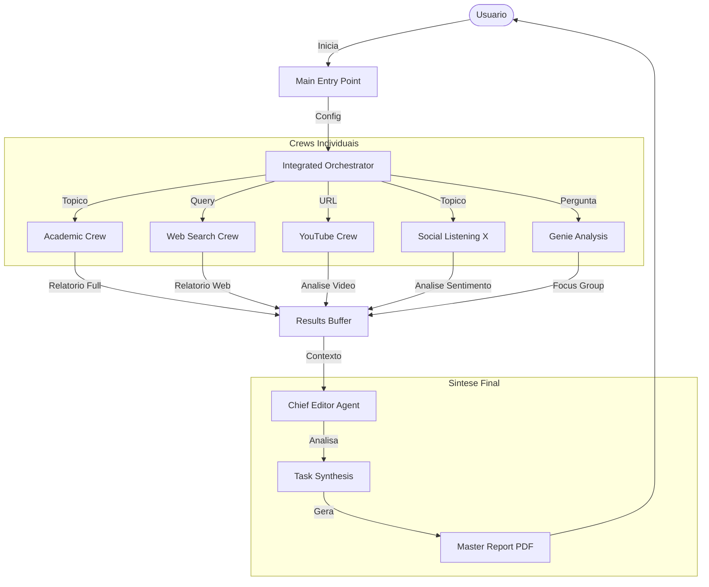

# Arquitetura do Sistema Desk Research

Este documento descreve a arquitetura técnica e o fluxo de dados do Sistema de Pesquisa Integrada da Ambev.

## Visão Geral

O Sistema Desk Research é uma plataforma modular de agentes autônomos (CrewAI) projetada para realizar pesquisas de mercado profundas e multifacetadas. O sistema opera em modos individuais (ex: apenas Pesquisa Acadêmica) ou em um **Modo Integrado**, onde múltiplos agentes trabalham em paralelo para fornecer uma visão holística.

## Diagrama de Fluxo (Modo Integrado)

## 🧠 Detalhamento dos Crews (Agentes e Tarefas)

Abaixo explicamos como cada "time" de robôs (Crew) funciona internamente.

### 1. 🎓 Academic Crew
Foca em rigor científico e papers revisados por pares.

*   **Agentes**:
    1.  **Academic Researcher**: Usa API OpenAlex/Scholar para encontrar papers recentes (últimos 5 anos) e relevantes.
    2.  **Literature Analyst**: Baixa os PDFs e **lê o texto completo** (não apenas resumos) para extrair metodologias, falhas e dados concretos.
    3.  **Academic Synthesizer**: Compila as descobertas em um report estruturado com citações ABNT e análise crítica.
*   **Fluxo**: Busca de Papers $\to$ Leitura Profunda de PDF $\to$ Síntese Bibliográfica.

### 2. 📺 YouTube Crew
Foca na visão da mídia, influenciadores e tutoriais.

*   **Agentes**:
    1.  **Video Researcher**: Usa um **Scraper Customizado** (sem API paga) para buscar vídeos no YouTube.
    2.  **YouTube Analyst**: Baixa as legendas (prioriza Manuais > Automáticas) e analisa o conteúdo para extrair sentimento, narrativas recorrentes e "tribos" de opinião.
*   **Fluxo**: Scraping de Busca $\to$ Extração de Transcrição $\to$ Análise de Conteúdo.

### 3. 🐦 Social Listening Crew (X)
Foca no pulso imediato do público e tendências virais.

*   **Agentes**:
    1.  **Planner**: Desenha a estratégia de busca (palavras-chave, hashtags, período).
    2.  **Researcher**: Executa a busca na API do X (limitada para evitar custos) e consolida tweets.
    3.  **Insight Analyst**: Agrupa os tweets em **Tribos de Opinião** (ex: Haters vs Lovers) e calcula sentimento.
    4.  **Report Writer**: Escreve um relatório executivo focado em risco e oportunidade de marca.
*   **Fluxo**: Planejamento $\to$ Coleta $\to$ Análise de Tribos $\to$ Redação Executiva.

### 4. 🌐 Web Search Crew

Foca em notícias do dia, concorrentes e comunicados oficiais.

*   **Agentes**:
    1.  **Web Researcher**: Varre o Google Search para encontrar notícias e blogs recentes.
    2.  **Content Analyzer**: Lê o conteúdo das páginas HTML encontradas.
    3.  **Report Writer**: Foca em novidades de mercado e movimentos da concorrência.
*   **Fluxo**: Busca Google $\to$ Scraping de URL $\to$ Relatório de Tendências.

### 5. 🧞 Genie Crew (Focus Group Virtual)
Foca em simulação qualitativa e previsão de aceitação.

*   **Agentes**:
    1.  **Genie Moderator**: Atua como moderador de uma sala de focus group.
*   **Mecânica**: O agente simula um debate entre 3 personas virtuais:
    *   😠 **O Cético**: Foca em preço e defeitos.
    *   😍 **O Brand Lover**: Foca em status e novidade.
    *   🤔 **O Pragmático**: Foca em custo-benefício.
*   **Output**: Um "Veredicto de Aceitação" baseado na discussão simulada.

### 6. ⏳ Consumer Hours Crew
Foca em auditoria profunda de marca e análise de grandes volumes de documentos.

*   **Processo**:
    1.  **Ingestor**: Lê documentos brutos (PDF/DOCX) de diretórios de entrada.
    2.  **RAG System**: Indexa o conteúdo para recuperação semântica.
    3.  **Auditor**: Cruza informações internas com percepção externa.
*   **Fluxo**: Ingestão $\to$ Indexação Vectorial $\to$ Análise Cruzada.

## Componentes Compartilhados

### Orchestrator (`src/desk_research/crews/integrated/`)
Responsável por chamar todos os crews acima, esperar seus resultados e passar tudo para o **Chief Editor**.

### Chief Editor Agent
Não gera novos dados. Ele lê os relatórios dos 5 crews e escreve o **Relatório Master Integrado**, destacando:
- Onde a Ciência (Academic) concorda com a Rua (Social)?
- Quais riscos (YouTube Haters) não apareceram nas notícias oficiais (Web)?

## Tecnologias Chave

- **Python 3.10+**: Linguagem base.
- **CrewAI**: Framework de orquestração de agentes.
- **CrewAI Flows**: Gerenciamento de fluxo de execução (State Management) para orquestração complexa.
- **Pydantic**: Validação estruturada de dados (garante que os relatórios sigam o padrão).
- **FPDF**: Geração de PDFs nativos e leves.
